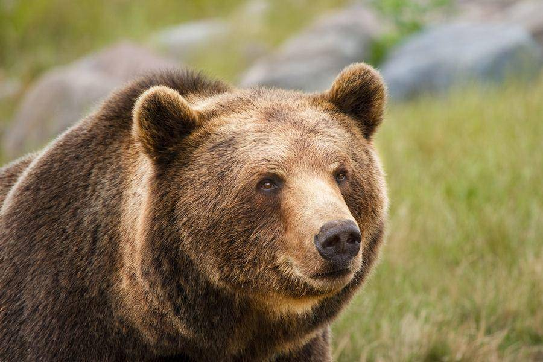
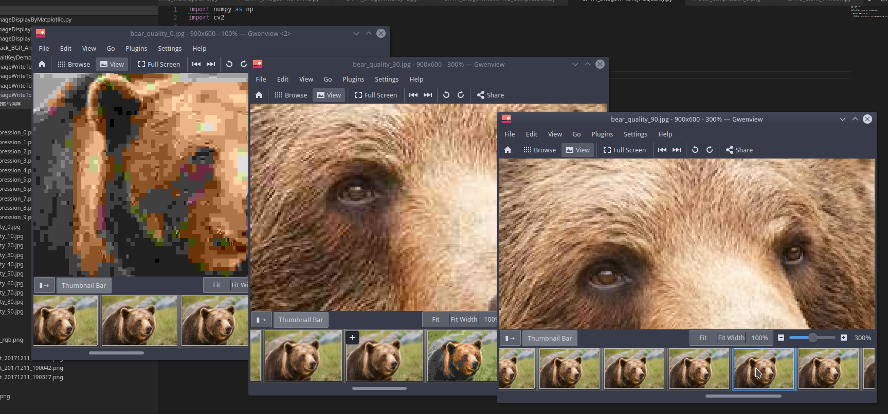
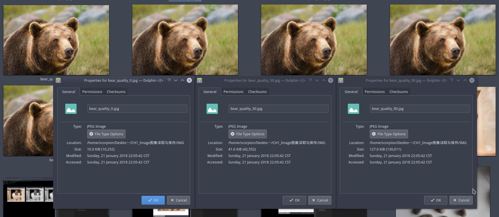
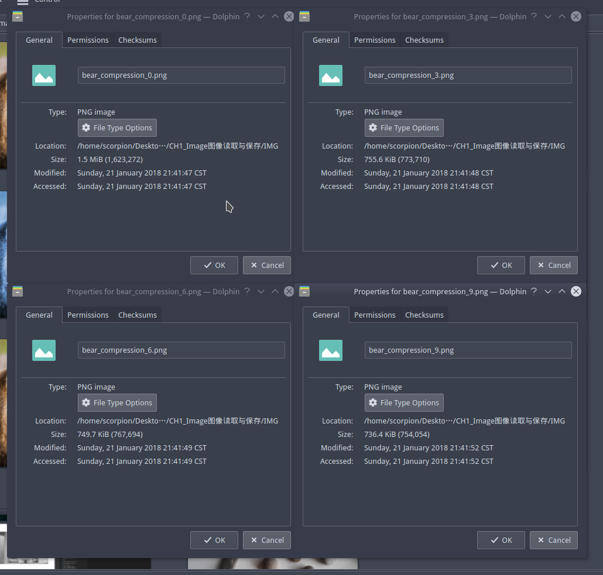

# 图片保存

## 概要

在之前的HighGUI展示图片的课程中, 阿凯没有讲解图像保存的问题. 图像的保存, 我们需要使用`imwrite` 函数.

阿凯给大家讲解了如何保存jpg格式与png格式的图片, 以及他们的压缩质量/压缩等级的设定.

**keywords** imwrite 保存图像 highgui


## 图像的简单保存

这次我们读入的还是小猫.  &:-)老面孔 


我们在读入img之后,  对图像进行各种操作, 例如图像均衡, 图像绘制等. 

接下来, 直接使用`imwrite` 函数, 第一个参数`./cat2.png`  是即将保存的文件路径与文件名. 因为我在Ubuntu下, 所以文件路径会使用斜杠 `/`, 函数的第二个参数就是图像矩阵`img`.


`image_save_as_png.py`

```python
import numpy as np
import cv2

# 导入一张图像 模式为彩色图片
img = cv2.imread('cat.jpg', cv2.IMREAD_COLOR)

# 读入灰度图
cv2.imwrite('cat2.png', img)
```


具体保存为什么图像格式, 是根据图像路径名字的后缀去判断的, 后缀为`.png` 就保存为`png` 格式的图片. 

哈哈, 阿凯猜到你已经会保存`JPEG` 格式的图片啦.


> 知识充电站:  jpg 跟 jpeg其实是一个东西, jpg是jpeg的简称. jpeg是Joint Photographic Experts Group（联合图像专家小组）的缩写

`image_save_as_jpg.py`

```python
import numpy as np
import cv2

# 导入一张图像 模式为彩色图片
img = cv2.imread('cat.jpg', cv2.IMREAD_COLOR)

# 保存为PNG图片
cv2.imwrite('./cat3.jpg', img)
```


关于 JPEG, PNG等格式之间图片的差异, 可以查阅知乎文章 [jpg和png有什么区别？](https://www.zhihu.com/question/29758228)


## 图像的压缩保存


图像的保真度, 靠`imwrite`函数的第三个参数来指定.

第三个参数, 针对不同的图片保存类型, 对应的含义也有所不同.


在图像压缩的演示里, 我们采用棕熊的图片.





### JPEG压缩保存

`JPEG` 的第三个参数所代表的意思是图像质量`cv2.IMWRITE_JPEG_QUALITY`, 取值范围在 0-100, 默认是95. 

```
cv2.imwrite('bear_quality_50.jpg', img, [cv2.IMWRITE_JPEG_QUALITY, 50])
```


我们将质量度分成10段 展示一下各种质量度下的图片.

`image_write_to_jpg_quality.py`

```python
import numpy as np
import cv2

# 导入一张图像 模式为彩色图片
img = cv2.imread('bear.jpg', cv2.IMREAD_COLOR)


for quality in range(0, 100, 10):
    
    # 保存为PNG图片
    cv2.imwrite('bear_quality_{}.jpg'.format(quality), img, [cv2.IMWRITE_JPEG_QUALITY, quality])
```





图像大小对比. 





### PNG压缩保存

PNG对应的称之为压缩级别 `cv2.IMWRITE_PNG_COMPRESSION`

压缩级别的取值范围从0到9. 0 代表无压缩, 9代表最大压缩.

例如我们使用压缩级别4去存储图片, 就可以这么写.

```python
cv2.imwrite('bear_compression_4.png', img, [cv2.IMWRITE_PNG_COMPRESSION, 4])
```


阿凯写个程序, 让大家直观的感受到不同压缩级别的效果.


`image_write_to_png_compression.py`

```python
import numpy as np
import cv2

# 导入一张图像 模式为彩色图片
img = cv2.imread('bear.png')


for cmpi in range(0, 10):
    # 保存为PNG图片
    cv2.imwrite('bear_compression_{}.png'.format(cmpi), img, [cv2.IMWRITE_PNG_COMPRESSION, cmpi])
    print("压缩级别 {}".format(cmpi))
    
```


说实话，打开图片看清晰度，　我们肉眼非常难看到有啥区别，不过我们可以通过文件属性文件大小来体现出来．




