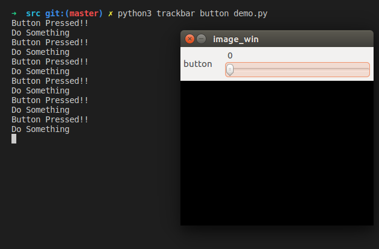

# 按键组件

## 概要
本文讲解了如何使用HighGUI实现按键功能。

**keywords** 按键 highgui 回调函数

## 事实的真相
OpenCV里面的按键组件其实不存在的, 有两种方式可以实现按键效果. 
第一种就是键盘事件监听(waitKey), 这一种可以算是实体按键.
另外一种是改造滑动条组件(Trackbar)变成按键.
Trackbar有两个取值0(逻辑假,按键未按下)跟1(逻辑真,按键按下).

## 演示代码



`trackbar_button_demo.py`

```python
import cv2
import time
# 创建窗口
cv2.namedWindow('image_win')


def do_something():
    print('Button Pressed!!')
    print('Do Something')


def update(x):
    if x == 1:
        do_something()
        cv2.waitKey(500)
        cv2.setTrackbarPos('button', 'image_win', 0)
    


cv2.createTrackbar('button','image_win',0,1,update)

# 等待按键按下
cv2.waitKey(0)
# 销毁窗口
cv2.destroyAllWindows()
```