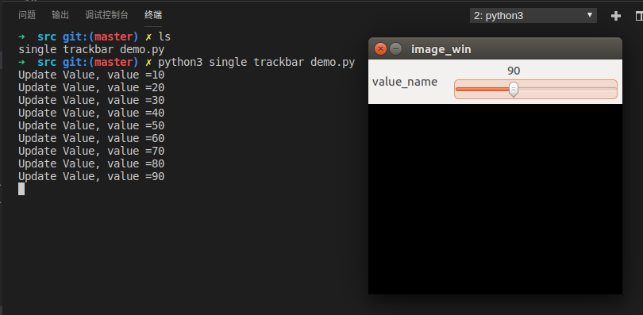
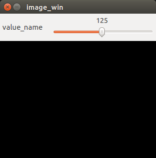
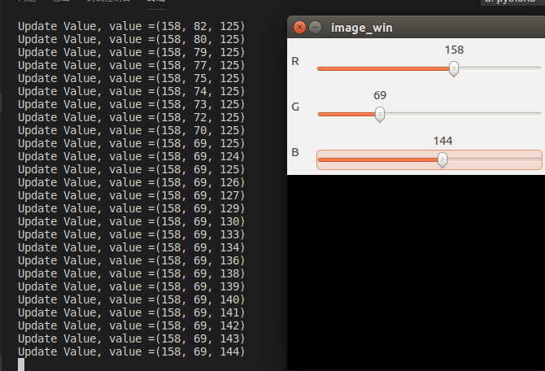

# 滑动条组件

## 概要
本文讲解了trackar的api，包括创建trackar，trackbar回调函数的使用， 获取多个trackar的取值。

**keywords** trackar 滑动条 回调函数 同步 createTrackbar setTrackbarPos getTrackbarPos

## 创建滑动条

首先我们需要创建一个Trackbar , 调用createTrackbar 这个函数

    cv2.createTrackbar(trackbar_name,window_name,min_value,max_value,callback_func)

 依次传入的函数

- trackbar_name 滑条的名称，获取这个滑条的数值也是通过名称
- window_name 滑条所在窗口 (window) 的名称
- min_value 滑条最小值
- max_value 滑条最大值
- callback_func 回调函数，这个参数其实类似C语言中的函数指针，我传入的是函数名称，每次滑条被拖动的时候，都会执行这个函数．　

例如：　

```python
# 这个nothing的意思就是啥也不做。
def nothing(x):
    pass
cv2.createTrackbar('gray_value','image',0,255,nothing)
```


这里的nothing(x) ,  被传入的x 实际上是滑条的当前取值。

你也可以改成这样， 看一下x 的值。

```python
# 这个nothing的意思就是啥也不做。
def nothing(x):
    print(x)
cv2.createTrackbar('gray_value','image',0,255,nothing)
```

x 是我命名的值， 你可以命名为任意名称。


**Trackbar的使用实例可以见通过HighGUI的Trackbar制作可变色背景**

.gif)


## 设置滑动条的位置

初始化滑动条的位置需要用到`setTrackbarPos`这个函数。


```python
cv2.setTrackbarPos('trackbar_name','window_name', value)
```

依次传入`Trackbar`的名字，`Trackbar`所在的窗口的名字， 还有`Trackbar`的初始值。

*使用样例*

```python
cv2.setTrackbarPos('gray_value','image'， 10)
```


## 获取滑动条的位置


除了在回调函数中获取Trackbar的取值， 还可以通过`getTrackbarPos` 函数获取`Trackbar`的取值。

依次传入`Trackbar`的名字，`Trackbar`所在的窗口的名字, 返回当前Trackbar的取值。

```python
value = cv2.getTrackbarPos('trackbar_name','window_name')
```


*使用样例*

```python
gvalue = cv2.getTrackbarPos('gray_value','image')
```


## 实例1-单个Trackbar

单个Trackbar的使用样例。


`single_trackbar_demo_01.py`
```python
import cv2

# 创建窗口
cv2.namedWindow('image_win')


value = None
def update(x):
    # 回调函数 更新value的值
    global value
    value = x
    print('Update Value, value ={}'.format(value))

# 创建一个滑动条对象 数值名字叫做 value_name
# 滑动条创建在 image_win 窗口之下
# 取值范围为 0-255, 回调函数为update
cv2.createTrackbar('value_name','image_win',0,255,update)

# 等待按键按下
cv2.waitKey(0)
# 销毁窗口
cv2.destroyAllWindows()
```

## 实例2-设定trackbar的默认取值

设定Trackbar上的默认值为125


```python
import cv2

# 创建窗口
cv2.namedWindow('image_win')


value = None
def update(x):
    # 回调函数 更新value的值
    global value
    value = x
    print('Update Value, value ={}'.format(value))

# 创建一个滑动条对象 数值名字叫做 value_name
# 滑动条创建在 image_win 窗口之下
# 取值范围为 0-255, 回调函数为update
cv2.createTrackbar('value_name','image_win',0,255,update)


cv2.setTrackbarPos('value_name','image_win',125)

# 等待按键按下
cv2.waitKey(0)
# 销毁窗口
cv2.destroyAllWindows()
```

## 实例3-获取多个Trackbar的Pos

三个trackar，每次有任意一个变更的时候都同步所有的值。




```python
import cv2

# 创建窗口
cv2.namedWindow('image_win')


value = (0, 0, 0)
def update(x):
    # 回调函数 更新value的值
    global value
    r_value = cv2.getTrackbarPos('R','image_win')
    g_value = cv2.getTrackbarPos('G', 'image_win')
    b_value = cv2.getTrackbarPos('B', 'image_win')
    
    value = (r_value, g_value, b_value)

    print('Update Value, value ={}'.format(value))

# 创建一个滑动条对象 数值名字叫做 R / G / B 
# 滑动条创建在 image_win 窗口之下
# 取值范围为 0-255, 回调函数为update
cv2.createTrackbar('R','image_win',0,255,update)
cv2.createTrackbar('G','image_win',0,255,update)
cv2.createTrackbar('B','image_win',0,255,update)


cv2.setTrackbarPos('R','image_win',125)
cv2.setTrackbarPos('G','image_win',125)
cv2.setTrackbarPos('B','image_win',125)

# 等待按键按下
cv2.waitKey(0)
# 销毁窗口
cv2.destroyAllWindows()
```