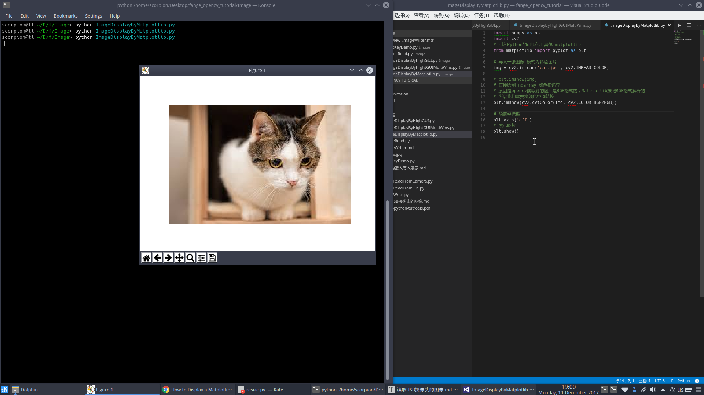

# Matplotlib显示彩图

## 概要

opencv读入的图片, 我们如何来显示它? Python科学计算里面有一个著名的可视化包, 名字叫做Matplotlib . 将图片的颜色空间进行转换后，分别用matplotlib显示RGB图跟灰度图。

**keywords** Matplotlib 图片显示 彩图

## 引入matplotlib的包

引入`pyplot`  并起别名为plt

```python
from matplotlib import pyplot as plt
```

使用`cv2`  读入图片. 读入彩图.

```python

import cv2
# 导入一张图像 模式为彩色图片
img = cv2.imread('cat.jpg', cv2.IMREAD_COLOR)
```

显示图片

```python
plt.imshow(img)
```

隐藏画布的坐标系, 并展示图片.

```python
# 隐藏坐标系
plt.axis('off')
# 展示图片
plt.show()
```

## plt错把BGR当作RGB

如果你跟着阿凯一步步做, 你肯定可以得到下面这个阴森森的图片.


因为matploblib的图片格式, 默认是RGB格式的, 之前阿凯讲过opencv 因为历史原因, 读入的图片的格式是BGR的.

所以, `R`通道变成了`B`通道, `B`通道变成了`R`通道, 所以才会这样.
如果想要正确显示图像，就需要使用cvtColor进行颜色空间的转换，从BGR转换为RGB。


## Matplotlib显示图片-正确演示

我们来看一下完整版本的程序.
代码见`CH1.2_ImageDisplayByMatplotlib.py`

```python
# -*- coding: utf-8 -*- 
import numpy as np
import cv2
# 引入Python的可视化工具包 matplotlib
from matplotlib import pyplot as plt

# 导入一张图像 模式为彩色图片
img = cv2.imread('cat.jpg', cv2.IMREAD_COLOR)

# plt.imshow(img)
# 直接绘制 ndarray 颜色很诡异
# 原因是opencv读取到的图片是BGR格式的，Matplotlib按照RGB格式解析的
# 所以我们需要将颜色空间转换
plt.imshow(cv2.cvtColor(img, cv2.COLOR_BGR2RGB))

# 隐藏坐标系
plt.axis('off')
# 展示图片
plt.show()
```

显示效果:




