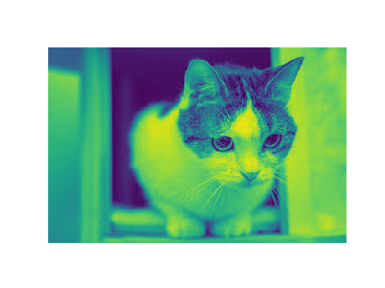
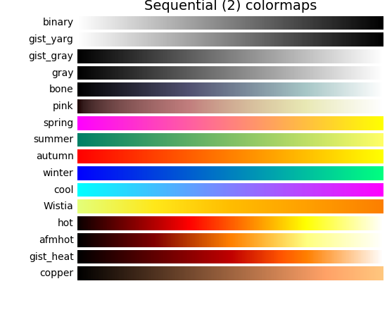
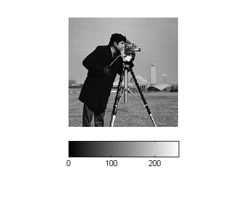
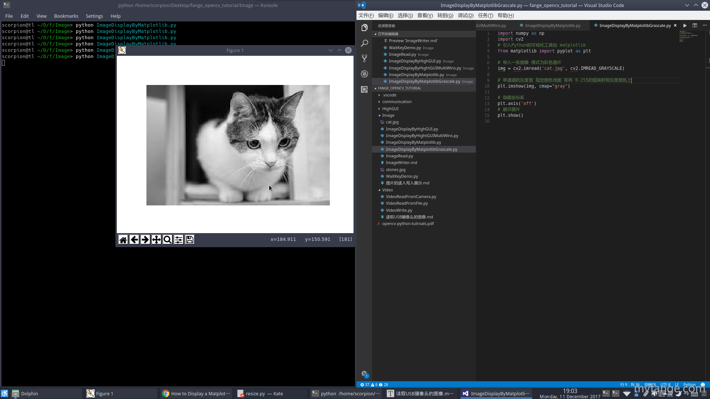

# Matplotlib显示灰度图

## 概要
本文讲解了如何将图片转换成灰度图,并通过matplotlib显示
**keywords** Matplotlib Grayscale cvtColor

## 转变为灰度图并显示

按照之前我们的思路, 使用cvtColor 将色彩空间从BGR转变为灰度图, 不就好了吗 , 我们来试一下。

```python
# -*- coding: utf-8 -*- 
import numpy as np
import cv2
# 引入Python的可视化工具包 matplotlib
from matplotlib import pyplot as plt

# 导入一张图像 模式为彩色图片
img = cv2.imread('cat.jpg', cv2.IMREAD_COLOR)

# 将色彩空间转变为灰度图并展示
gray  = cv2.cvtColor(img, cv2.COLOR_BGR2GRAY)

plt.imshow(gray)

# 隐藏坐标系
plt.axis('off')
# 展示图片
plt.show()

```



天啊噜， 这个更恐怖了， 我们来打印一下图片的信息。

```python
def print_img_info(img):
    print("================打印一下图像的属性================")
    print("图像对象的类型 {}".format(type(img)))
    print(img.shape)
    print("图像宽度: {} pixels".format(img.shape[1]))
    print("图像高度: {} pixels".format(img.shape[0]))
    # GRAYScale 没有第三个维度哦， 所以这样会报错
    # print("通道: {}".format(img.shape[2]))
    print("图像分辨率: {}".format(img.size))
    print("数据类型: {}".format(img.dtype))
    
```

```python
print_img_info(gray)
```

这里是图片信息

```
图像对象的类型 <class 'numpy.ndarray'>
(182, 277)
图像宽度: 277 pixels
图像高度: 182 pixels
图像分辨率: 50414
数据类型: uint8

```

可以看到， 不同与彩色图， grascale没有第三个维度， 是一个扁平的二维矩阵。 我们选择灰度图的部分， 打印出来看一下。

```python
print("打印图片局部")
print(gray[100:105, 100:105])
```

roi图片像素点格式如下。

```
打印图片局部
[[221 221 221 221 219]
 [220 220 220 220 219]
 [219 219 219 219 218]
 [219 219 219 219 218]
 [214 215 215 216 216]]

```

## 给matplotlib添加cmap显示灰度图

为什么我们给matplotlib传入一个矩阵，matplotlib却傻傻的分不清颜色， 不能转变为我们想要的灰度图呢？

原因在于， 我们需要给matplotlib给定一个颜色映射函数。也就是从数值转变为颜色的映射。

我们称之为`color map` ， 在matplotlib里面简称为`cmap`.

所有的颜色阈值， 可以在matplotlib的文档里看到：[color example code: colormaps_reference.py](https://matplotlib.org/examples/color/colormaps_reference.html)



我们这里需要用到其中一个均衡组里面的`gray` 颜色映射。 

其中最黑代表`0`, 最亮代表`255`

> 阿凯喜欢在教程里堆很多图片， 可以帮助大家理解。



关键语句

```python
# 需要添加colormap 颜色映射函数为gray
plt.imshow(gray, cmap="gray")
```

完整版本的程序

`CH1.2_ImageDisplayByMatplotlib_Grayscale.py`

```python
# -*- coding: utf-8 -*- 
import numpy as np
import cv2
# 引入Python的可视化工具包 matplotlib
from matplotlib import pyplot as plt

def print_img_info(img):
    print("================打印一下图像的属性================")
    print("图像对象的类型 {}".format(type(img)))
    print(img.shape)
    print("图像宽度: {} pixels".format(img.shape[1]))
    print("图像高度: {} pixels".format(img.shape[0]))
    # GRAYScale 没有第三个维度哦， 所以这样会报错
    # print("通道: {}".format(img.shape[2]))
    print("图像分辨率: {}".format(img.size))
    print("数据类型: {}".format(img.dtype))

# 导入一张图像 模式为彩色图片
img = cv2.imread('cat.jpg', cv2.IMREAD_COLOR)

# 将色彩空间转变为灰度图并展示
gray  = cv2.cvtColor(img, cv2.COLOR_BGR2GRAY)

# 打印图片信息
# print_img_info(gray)

# 打印图片的局部
# print("打印图片局部")
# print(gray[100:105, 100:105])

# plt.imshow(gray)
# 需要添加colormap 颜色映射函数为gray
plt.imshow(gray, cmap="gray")

# 隐藏坐标系
plt.axis('off')
# 展示图片

plt.show()
# 你也可以保存图片， 填入图片路径就好
# plt.savefig("cat_gray_01.png")
```

然后我们显示一下效果。

