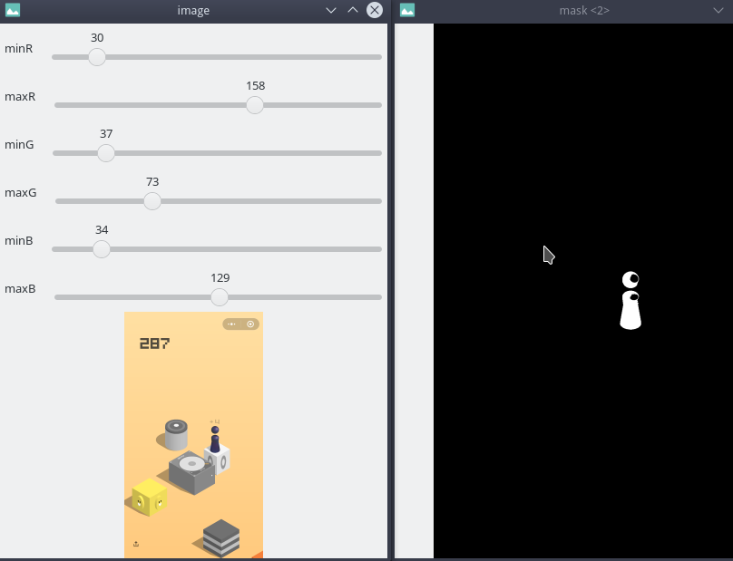

# 二值化可视化调参

## 概要
本文讲解了如何在RGB色彩空间,HSV色彩空间通过HighGUI的组件进行可视化调参.

**keyboards** RGB HSV 色彩空间 可视化调参

## 例程1:RGB色彩空间GUI可视化调参
上面介绍的方法, 使用起来还有诸多限制, 调参也不太方便. 既然我们学了`HighGUI` 组件, 我们就可以制作好用的调参软件.





注意这种方法也有对应的弊端. 

取决于背景与其他物体的颜色对比. 所以阿凯的建议是, 根据ROI颜色统计作为基准, 然后微调滑块.


`threshold_editor_gui_rgb.py`
```python
# -*- coding: utf-8 -*- 
'''
    可视化颜色阈值调参软件
'''

import cv2
import numpy as np

# 样例图片
img = cv2.imread("screenshot.png")

# 颜色阈值 Upper
upperb = None
# 颜色阈值 Lower
lowerb = None

# 更新MASK图像，并且刷新windows
def updateMask():
    global img
    global lowerb
    global upperb

    # 计算MASK
    mask = cv2.inRange(img, lowerb, upperb)

    cv2.imshow('mask', mask)

# 更新阈值
def updateThreshold(x):

    global lowerb
    global upperb

    minR = cv2.getTrackbarPos('minR','image')
    maxR = cv2.getTrackbarPos('maxR','image')
    minG = cv2.getTrackbarPos('minG','image')
    maxG = cv2.getTrackbarPos('maxG', 'image')
    minB = cv2.getTrackbarPos('minB', 'image')
    maxB = cv2.getTrackbarPos('maxB', 'image')
    
    lowerb = np.int32([minB, minG, minR])
    upperb = np.int32([maxB, maxG, maxR])
    
    print('更新阈值')
    print(lowerb)
    print(upperb)
    updateMask()

cv2.namedWindow('image', flags= cv2.WINDOW_NORMAL | cv2.WINDOW_FREERATIO)
# cv2.namedWindow('image')
cv2.imshow('image', img)

# cv2.namedWindow('mask')
cv2.namedWindow('mask', flags= cv2.WINDOW_NORMAL | cv2.WINDOW_FREERATIO)

# 红色阈值 Bar
## 红色阈值下界
cv2.createTrackbar('minR','image',0,255,updateThreshold)
## 红色阈值上界
cv2.createTrackbar('maxR','image',0,255,updateThreshold)
## 设定红色阈值上界滑条的值为255
cv2.setTrackbarPos('maxR', 'image', 255)
# 绿色阈值 Bar
cv2.createTrackbar('minG','image',0,255,updateThreshold)
cv2.createTrackbar('maxG','image',0,255,updateThreshold)
cv2.setTrackbarPos('maxG', 'image', 255)
# 蓝色阈值 Bar
cv2.createTrackbar('minB','image',0,255,updateThreshold)
cv2.createTrackbar('maxB','image',0,255,updateThreshold)
cv2.setTrackbarPos('maxB', 'image', 255)

# 首次初始化窗口的色块
# 后面的更新 都是由getTrackbarPos产生变化而触发
updateThreshold(None)

print("调试棋子的颜色阈值, 键盘摁e退出程序")
while cv2.waitKey(0) != ord('e'):
    continue

cv2.destroyAllWindows()
```


## 例程2:RGB色彩空间GUI可视化调参


```bash
python3 threshold_editor_gui_hsv.py tiaoyitiao.png
```

`threshold_editor_gui_hsv.py`
```python
# -*- coding: utf-8 -*- 
'''
    可视化颜色阈值调参软件
'''

import cv2
import numpy as np
import sys

# 更新MASK图像，并且刷新windows
def updateMask():
    global img
    global lowerb
    global upperb
    global mask
    # 计算MASK
    mask = cv2.inRange(img_hsv, lowerb, upperb)

    cv2.imshow('mask', mask)

# 更新阈值
def updateThreshold(x):

    global lowerb
    global upperb

    minH = cv2.getTrackbarPos('minH','image')
    maxH = cv2.getTrackbarPos('maxH','image')
    minS = cv2.getTrackbarPos('minS','image')
    maxS = cv2.getTrackbarPos('maxS', 'image')
    minV = cv2.getTrackbarPos('minV', 'image')
    maxV = cv2.getTrackbarPos('maxV', 'image')
    
    lowerb = np.int32([minH, minS, minV])
    upperb = np.int32([maxH, maxS, maxV])
    
    print('更新阈值')
    print(lowerb)
    print(upperb)
    updateMask()

def main(img):
    global img_hsv
    global upperb
    global lowerb
    global mask
    # 将图片转换为HSV格式
    img_hsv = cv2.cvtColor(img, cv2.COLOR_BGR2HSV)

    # 颜色阈值 Upper
    upperb = None
    # 颜色阈值 Lower
    lowerb = None

    mask = None

    cv2.namedWindow('image', flags= cv2.WINDOW_NORMAL | cv2.WINDOW_FREERATIO)
    # cv2.namedWindow('image')
    cv2.imshow('image', img)

    # cv2.namedWindow('mask')
    cv2.namedWindow('mask', flags= cv2.WINDOW_NORMAL | cv2.WINDOW_FREERATIO)

    # 红色阈值 Bar
    ## 红色阈值下界
    cv2.createTrackbar('minH','image',0,255,updateThreshold)
    ## 红色阈值上界
    cv2.createTrackbar('maxH','image',0,255,updateThreshold)
    ## 设定红色阈值上界滑条的值为255
    cv2.setTrackbarPos('maxH', 'image', 255)
    cv2.setTrackbarPos('minH', 'image', 0)
    # 绿色阈值 Bar
    cv2.createTrackbar('minS','image',0,255,updateThreshold)
    cv2.createTrackbar('maxS','image',0,255,updateThreshold)
    cv2.setTrackbarPos('maxS', 'image', 255)
    cv2.setTrackbarPos('minS', 'image', 0)
    # 蓝色阈值 Bar
    cv2.createTrackbar('minV','image',0,255,updateThreshold)
    cv2.createTrackbar('maxV','image',0,255,updateThreshold)
    cv2.setTrackbarPos('maxV', 'image', 255)
    cv2.setTrackbarPos('minV', 'image', 0)

    # 首次初始化窗口的色块
    # 后面的更新 都是由getTrackbarPos产生变化而触发
    updateThreshold(None)

    print("调试棋子的颜色阈值, 键盘摁e退出程序")
    while cv2.waitKey(0) != ord('e'):
        continue

    cv2.imwrite('tmp_bin.png', mask)
    cv2.destroyAllWindows()

if __name__ == "__main__":
    # 样例图片 (从命令行中填入)
    image_path = sys.argv[1]
    # 样例图片 (在代码中填入)
    # img = cv2.imread('cfs_samples.jpg')
    img = cv2.imread(image_path)
    if img is None:
        print("Error: 文件路径错误，没有此图片 {}".format(image_path))
        exit(1)
    
    main(img)
```