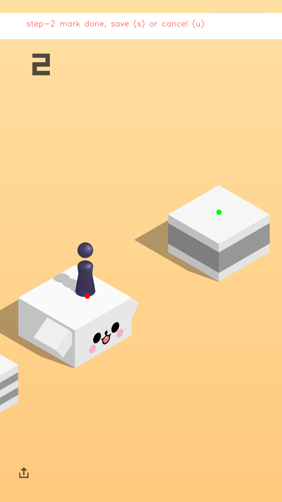
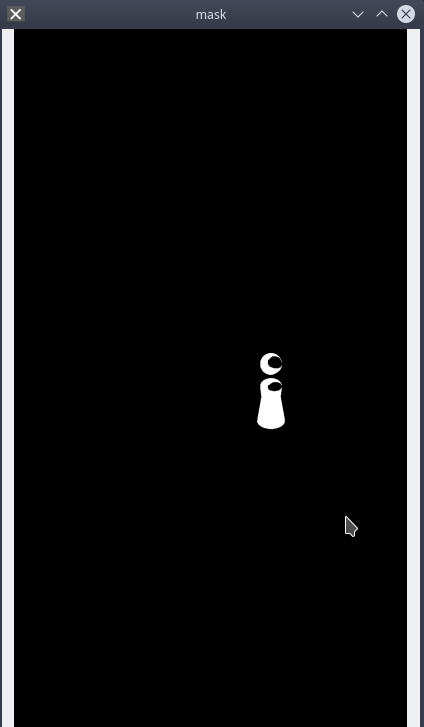

# 全局二值化

## 概要
本节课程讲解了如何使用`inRange`函数,将彩图转换成二值化图像.

**keywords** inRange 二值化

## inRange函数API讲解

`inRange` 函数判断图像的像素点是否在阈值范围内.

如果在阈值范围内该点的值就为逻辑`1`, 在灰度图中用值`255`表示. 如果在范围之外, 就为逻辑`0`, 用值`0`表示.

**注意返回的mask是二维的**

```python
mask = cv2.inRange(src, lowerb, upperb)
```

**参数解释**

* `src` : 源图像
* `lowerb`: 颜色阈值下界 lower boundary 
* `upperb`: 颜色阈值上界 upper boundary


## 例程-获取跳一跳棋子的二值化图像



> TODO
在`CH4.2`中我们获取了棋子颜色的统计图.


由此得出了上界与下界.

注意阈值格式是BGR格式的 :`(B,G,R)`


`lowerb` : `(50, 36, 36)`

`upperb` : `(104, 80, 80)`


`binary_demo.py`

```python
import cv2
import numpy as np

# 读入图片
img = cv2.imread('screenshot.png')
# 判断图片是否正确读入
if img is None:
    print("请检查图片路径")
    exit()

# 阈值下界
lowerb = (50, 36, 36)
# 阈值上界
upperb = (104, 80, 80)

# 图像二值化
mask = cv2.inRange(img, lowerb, upperb)

cv2.namedWindow("mask", flags= cv2.WINDOW_NORMAL | cv2.WINDOW_FREERATIO)
cv2.imshow('mask', mask)
cv2.waitKey(0)
```





**mask其实是一个灰度图 , 只有两个值 0 跟255**

可以看到白色的地方就是逻辑`1`  值为`255`

黑色的地方就是0.

