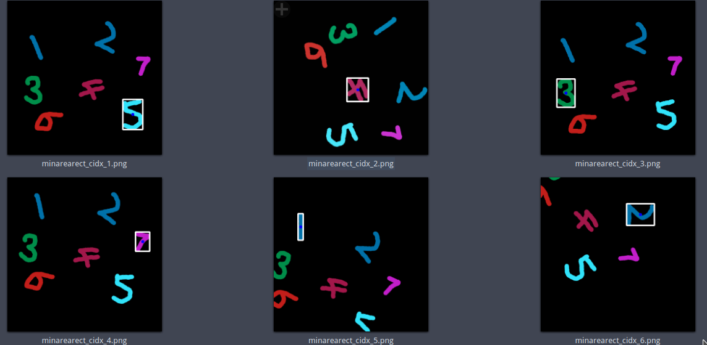
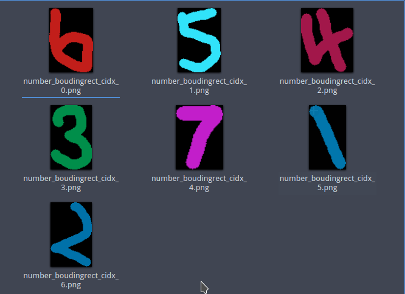

# 项目实战-提取手写数字图片样本

## 概要
在`CH5.2_轮廓的外接矩形`这篇文章里，阿凯通过`MinAreaRect`函数获取到了带旋转的数字区域．
> TODO

本章阿凯介绍了图像变换的操作，利用这些操作，我们就可以将此矩形区域提取出来，并提取出统一尺寸的二值化图像.


**keywords** 外界矩形 缩放 提取

## 提取最小外接矩形区域

我们可以根据`minAreaRect` 函数返回的数据结构， 以矩形中心`(cx, cy)`作为对原来图像旋转的中心点，旋转角度设定为`theta`

```python
# 声明旋转矩阵
rotateMatrix = cv2.getRotationMatrix2D((cx, cy), theta, 1.0)
# 获取旋转后的图像
rotatedImg = cv2.warpAffine(img, rotateMatrix, (img.shape[1], img.shape[0]))
```




```python
'''
    利用minAreaRect绘制最小面积矩形并绘制
'''
import numpy as np
import cv2

# 读入黑背景下的彩色手写数字
img = cv2.imread("color_number_handwriting.png")
# 转换为gray灰度图
gray = cv2.cvtColor(img, cv2.COLOR_BGR2GRAY)
# 寻找轮廓
bimg, contours, hier = cv2.findContours(gray, cv2.RETR_EXTERNAL, cv2.CHAIN_APPROX_SIMPLE)

for cidx,cnt in enumerate(contours):
    minAreaRect = cv2.minAreaRect(cnt)
    # 转换为整数点集坐标
    # rectCnt = np.int64(cv2.boxPoints(minAreaRect))
    ((cx, cy), (w, h), theta) = minAreaRect
    
    cx = int(cx)
    cy = int(cy)
    w = int(w)
    h = int(h)
    # 获取旋转矩阵
    rotateMatrix = cv2.getRotationMatrix2D((cx, cy), theta, 1.0)
    rotatedImg = cv2.warpAffine(img, rotateMatrix, (img.shape[1], img.shape[0]))
    pt1 = (int(cx - w/2), int(cy - h/2))
    pt2 = (int(cx + w/2), int(cy + h/2))
    # 原图绘制矩形区域
    cv2.rectangle(rotatedImg, pt1=pt1, pt2=pt2,color=(255, 255, 255), thickness=3)
    # 绘制中心点
    cv2.circle(rotatedImg, (cx, cy), 5, color=(255, 0, 0), thickness=-1)
    cv2.imwrite("minarearect_cidx_{}.png".format(cidx), rotatedImg)
```


## 数字样本图像转换为统一尺寸

我们截取了包含数字的外接矩形， 他们形状各异。(可能需要手动旋转)



如果是制作神经网络所需要的样本图片的话， 我们就需要将其放缩到统一大小。

接下来我们将图片统一变换到　`15*25`  并转换为二值化图像。


```python
import numpy as np
import cv2
from glob import glob

img_paths = glob('./number_raw/*.png')

# 新的维度为10×20
new_dimension = (15, 25)

for img_path in img_paths:
    # 读入灰度图
    img = cv2.imread(img_path,cv2.IMREAD_GRAYSCALE)
    img_name = img_path.split('/')[-1]
    # 缩放
    resized = cv2.resize(img, new_dimension)
    # 二值化图片
    ret,thresh = cv2.threshold(resized,10,255,0)

    cv2.imwrite('./number_bin/'+img_name,thresh)
```


