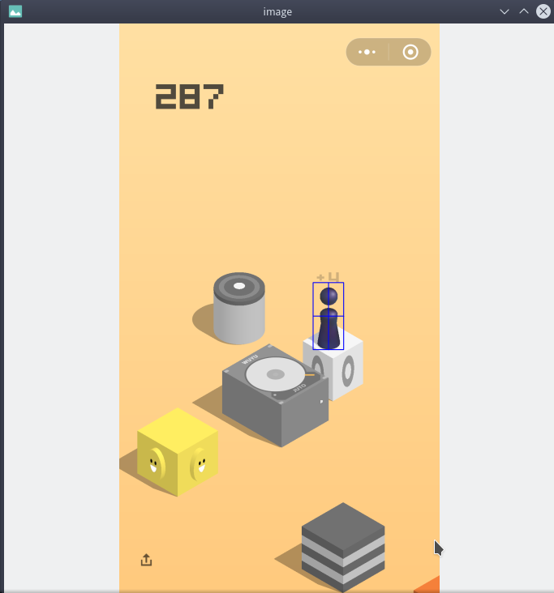
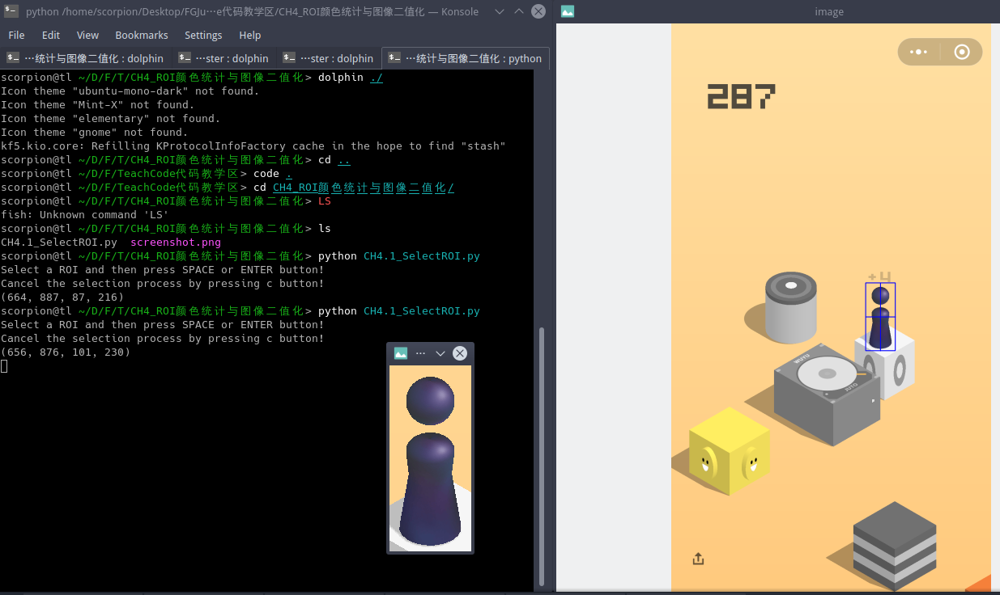

# 图像切割与ROI


## 概要
讲解了使用OpenCV的SelectROI函数, 裁剪图片获取图片的局部(ROI)

**keywords** ROI SelectROI 切割 索引

## SelectROI函数介绍


`selectROI`这个函数封装在opencv拓展包`xfeature2d`里面, 如果opencv是你自己编译的要注意, 编译的时候要添加拓展选项.

关键函数就这么一行代码.

```python
# Select ROI
rect = cv2.selectROI("image", img, showCrosshair, fromCenter)
```


**参数解释**

* `"image"` : winName 窗口名称
* `img` : 目标想要裁剪的图像
* `showCrosshair` : 是否显示网格
  * `True` 显示网格
  * `False` 只有矩形
* `fromCenter`:
  * `True` 第一次选中的点为矩形的中心.
  * `False` 第一次选中的点为矩形的左上角.


返回的是一个tuple值, 代表矩形区域. 分别代表矩形左上角坐标 (x, y) 与矩形宽度`w`跟高度`h`

```python
(x, y, w, h) = rect
```

切片的时候一定要注意,  第一维指的是行数, 第二维度指的是列数. 

```python
imCrop = img[y : y+h, x:x+w]
```


## 使用过程

第一步我们要选中这个矩形区域.



接下来我们来确认是否选中.

如果你要重新选择, 需要在别的地方点击一下.

如果确认的话, 按`Enter`回车 或者`Blank`空格键. 

如果撤销选择, 按`c`键.





这就是我们最终获取的ROI区域的图片.


## 源代码


`src/select_roi_demo.py`
```python
'''
回车或者空格确认选择
c键 撤销选择
'''
import numpy as np
import cv2

# 设定文件路径
img_path = './screenshot.png'
# Read image
img = cv2.imread(img_path)

# 创建一个窗口
cv2.namedWindow("image", flags= cv2.WINDOW_NORMAL | cv2.WINDOW_FREERATIO)
cv2.namedWindow("image_roi", flags= cv2.WINDOW_NORMAL | cv2.WINDOW_FREERATIO)

cv2.imshow("image", img)
# 是否显示网格 
showCrosshair = True
# 如果为Ture的话 , 则鼠标的其实位置就作为了roi的中心
# False: 从左上角到右下角选中区域
fromCenter = False
# Select ROI
rect = cv2.selectROI("image", img, showCrosshair, fromCenter)

print("选中矩形区域")
(x, y, w, h) = rect

# Crop image
imCrop = img[y : y+h, x:x+w]

# Display cropped image
cv2.imshow("image_roi", imCrop)
cv2.imwrite("image_roi.png", imCrop)
cv2.waitKey(0)
```

