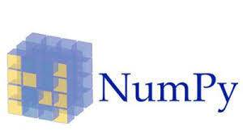
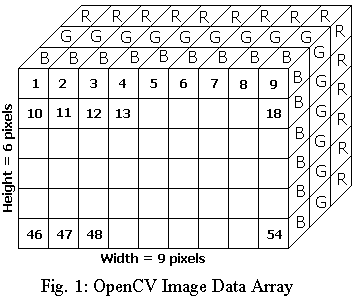
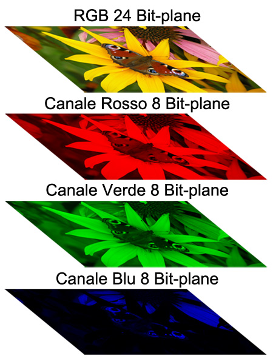

# 图像的数据结构


## 概要
讲解了图像的数据结构Numpy

**keywords** numpy 图像 数据结构


## 图像的数据结构


> TODO 这篇文章不合格 须要重构


opencv图像读取(`imread`) 读入的数据格式是numpy的ndarray数据格式. 

> TODO 其实介绍图像的数据结构,须要以BGR彩图与Graysacle为例子来讲解

如果你对此不是很了解, 可以参照阿凯写的Numpy快速入门教程.



[Numpy快速入门-阿凯带你玩转Python科学计算](http://www.1zlab.com(网站备案中)/p/numpy-quick-start)
> TODO 更换URL


> 因为阿凯在给大家教授python-opencv, 而在python-opencv读入一个图片对象就是numpy的ndarray类型, 所以阿凯有必要在这里给大家讲解一下numpy的一些基础操作. 同时还会介绍numpy中两个重要的概念全局函数与广播. 最后阿凯还介绍了numpy下面的两个包, linalg线形代数计算包与random随机生成包.

下面是以BGR格式为例介绍Image的数据结构.



第一维度 : `Height` 高度, 对应这张图片的 `nRow`行数

第二维度 : `Width` 宽度, 对应这张图片的`nCol` 列数

第三维度: `Value` BGR三通道的值. 

BGR 分别代表

B: `Blue`  蓝色

G: `Green` 绿色

R: `Red` 红色




> TODO 这里是不是不太好这么讲?


我随便取了一个图片5*5的小方块, 大家感受一下.


```python
In [18]: img[100:105, 100:105]
Out[18]: 
array([[[29, 15,  0],
        [29, 14,  0],
        [29, 13,  1],
        [29, 13,  1],
        [29, 12,  3]],

       [[27, 14,  0],
        [27, 14,  0],
        [27, 14,  0],
        [27, 13,  1],
        [29, 12,  3]],

       [[27, 14,  0],
        [25, 14,  0],
        [25, 14,  0],
        [23, 14,  1],
        [29, 12,  3]],

       [[25, 15,  0],
        [25, 14,  0],
        [23, 14,  0],
        [23, 14,  0],
        [27, 12,  3]],

       [[25, 15,  0],
        [23, 14,  0],
        [23, 14,  0],
        [22, 15,  0],
        [27, 12,  3]]], dtype=uint8)

```

这里大家还可以看到, 这个图像数据存储格式是`uint8`, 也就是正数类型, 用八位存储像素的取值. 

`dtype=uint8` 取值范围是 0 至2^8-1也就是255. 