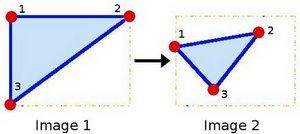
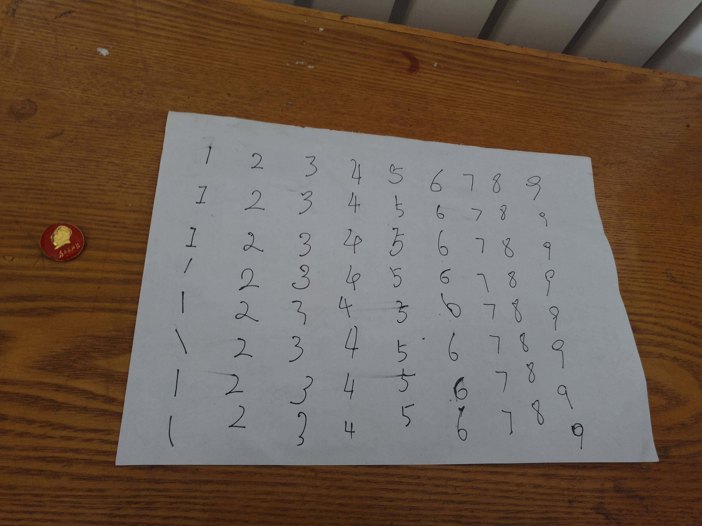
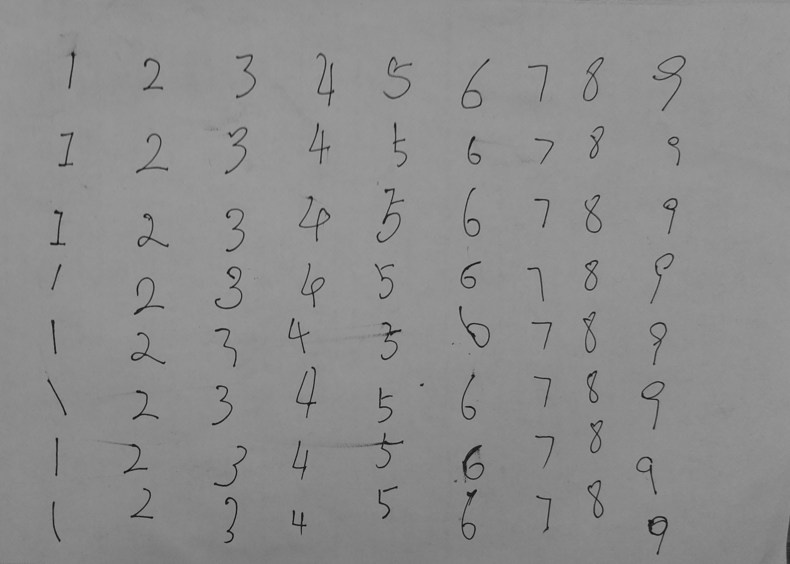

# 图像透视变换

## 概要

讲解OpenCV中投影的概念,还给出了一个投影的样例.

**keyboards** 投影 perspective-projection 图像变形 

## 什么是透视变换


之前我们在 **CH5.3 图像2D仿射变换-** 里面讲解的是仿射变换**AffineTransform**。

那么透视变换与仿射变换之间最大的区别是什么呢？

**画面中两个平行的边，仿射变换过后，依然保持平行。** 三点可以确定一个变换。



而透视变换则不一定，所以**可以将仿射变换作为投影变换的一个特例。** 需要四个点，才能确定透视变换。


举一个来自官网的例子

[Geometric Transformations of Images](https://docs.opencv.org/3.0-beta/doc/py_tutorials/py_imgproc/py_geometric_transformations/py_geometric_transformations.html#geometric-transformations)


```python
import cv2
import matplotlib.pyplot as plt
import numpy as np

img = cv2.imread('sudokusmall.png')
rows,cols,ch = img.shape
# 左图中画面中的点的坐标 四个
pts1 = np.float32([[56,65],[368,52],[28,387],[389,390]])
# 变换到新图片中，四个点对应的新的坐标 一一对应
pts2 = np.float32([[0,0],[300,0],[0,300],[300,300]])

# 生成变换矩阵
M = cv2.getPerspectiveTransform(pts1,pts2)
# 进行透视变换
dst = cv2.warpPerspective(img,M,(300,300))

plt.subplot(121),plt.imshow(img),plt.title('Input')
plt.subplot(122),plt.imshow(dst),plt.title('Output')
plt.show()
```


## 透视变换的应用


下面这张图片是原始图像，我们相获取A4纸上面的内容，而且我们也只关心这部分。


假设已经知道了A4纸四边形的近似顶点在图形中的坐标，如下所示：

```python
[[[ 922  632]]

 [[ 659 2694]]

 [[3794 2630]]

 [[3362  857]]]

```

同时，因为之前边缘处进行了膨胀，所以变换回去的时候， 可以内缩。

```python
# 因为之前膨胀了很多次，所以四边形区域需要向内收缩而且本身就有白色边缘
margin=40
pts1 = np.float32([[921+margin, 632+margin], [659+margin, 2695-margin], [3795-margin, 2630-margin], [3362-margin, 856+margin]])
```

A4纸的宽高比在 1.4 ： 1, 所以定义新图片的四个顶点。

```python
pts2 = np.float32([[0,0], [0, 1000], [1400, 1000], [1400, 0]])
```

```python
M = cv2.getPerspectiveTransform(pts1,pts2)
dst = cv2.warpPerspective(gray,M,(1400,1000))
```

最终得到了我们想要的图片。




更详细的流程见手写数字识别专题中的:

 [寻找A4纸所在的四边形区域与变形_paper-image-perspective-transformation](寻找A4纸所在的四边形区域与变形_paper-image-perspective-transformation)


