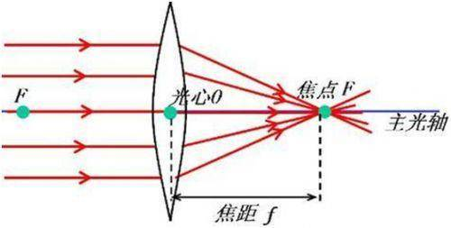
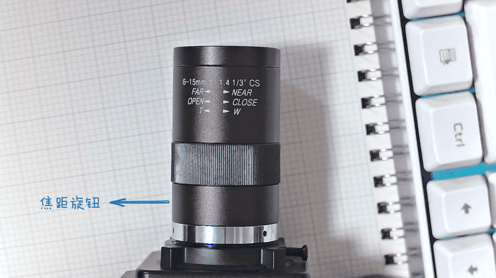
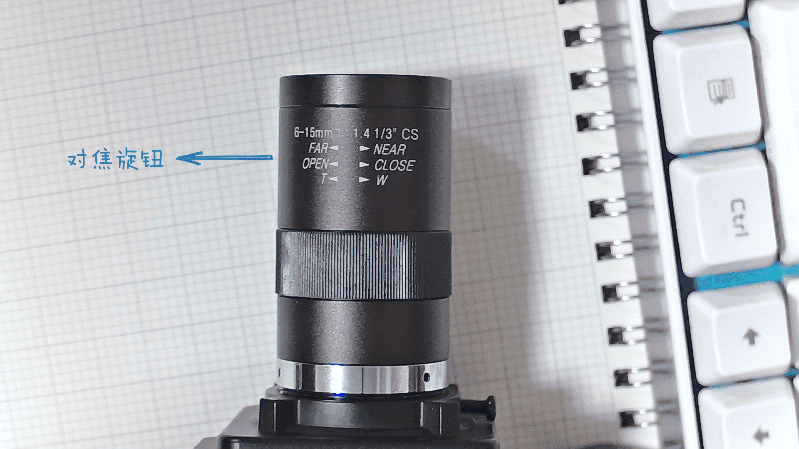
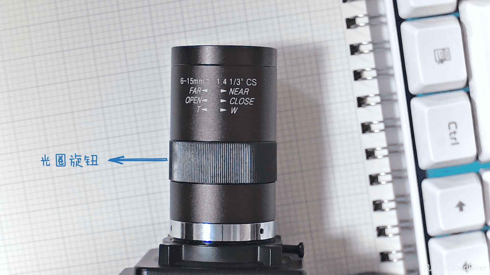
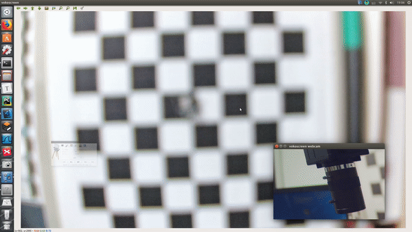

# 焦距与USB摄像头镜头调焦

## 概要

本文以宽动态摄像头配套的手动变焦镜头为例， 讲解了镜头的各个组成部分(焦距旋钮，对焦旋钮与光圈) ，与镜头调焦与对焦的流程介绍，最后提供了调焦流程的演示视频。

**keyboards** 摄像头 变焦 焦距 对焦

## 1. 镜头结构介绍

### 结构1: 焦距(Focal Length)旋钮

在光学中，光学镜片中心到**焦点(Focal Point)**的距离叫做**焦距（Focal Length）**.

在我们手里拿到的这个手动变焦摄像头中，**W---T** 所标示的就是调整焦距的旋钮。

焦距旋钮用于变焦**ZOOM** , 用于调整整个画面的可见范围。 旋转**焦距旋钮**是镜头调焦的第一步。

**W : Wide Angle 广角（短焦)**

越往W的方向扭，镜头的焦距就越短，可以看到的范围更大,  拍摄对象占比更小，观察到更宏观的信息。

**T: Telephoto 长焦** 越往T的方向扭，镜头的焦距就越长，可以看到的范围更小、拍摄对象占比更大, 可以看到更多细节。

注：对比图片为对焦之后的。

### 结构2: 对焦(Focus)旋钮

我们调节完焦距之后，大部分情况下， 画面都是很模糊的， 原因在于，焦点(facal point)没有准确的落在感光器件上， 可能落在了感光芯片之前，或者之后。 我们需要将焦点准确的落在感光器件上，我们就需要进行镜头调焦的第二步，旋转**对焦(Focus)旋钮**, 这个过程，就称之为**对焦(Focus)** 。

工作距离，就是调整镜头与视场平面之间的距离。

**FAR 远距**  使得更远处的光线的焦点落在感光芯片上。（理论上可以是无穷远）

**NEAR 近距** 使得更近处的光线的焦点落在感光芯片上，一般镜头都有一个最近距离的约束。例如阿凯正在使用的这款宽动态摄像头搭配的镜头，最近距离为1cm。

### 结构3: 光圈(Aperture)旋钮

光圈用于控制进入镜头光线的数量， 控制图像的亮度，光圈需要根据周围的光照强度动态调节。

**OPEN 打开** 为光圈调大方向，向此方向调节镜头会使镜头的光圈变大，这时进光量会增加，使图像更明亮，但过亮也会使图像曝光过度。调到底时光圈最大。

**CLOSE 关闭**  为光圈调小方向，向此方向调节镜头会使镜头的光圈变小，这时进光量会减少，使图像更昏暗，但过暗也会使图像不清楚。调到底时光圈最小，甚至完全关闭。

摄像头对于光线的最低要求，称之为**敏感度** （也叫做最低照度）， 这取决于感光芯片。 

根据最低照度对摄像头进行分类，依次为正常，月光级摄像头，星光级摄像头。

其中星光级摄像头的敏感度最强， 正常工作仅需要 **0.0001Lux**的光照强度。（注： lux 勒克斯为光照强度单位。）

星光级摄像头是整个USB摄像头品类里面最贵的(问清楚感光芯片的型号, 然后在淘宝上搜竞品, 一般不会被坑.),简易大家在买之前一定要问清楚到底是不是**星光级**摄像头, 主要看参数**0.0001Lux**, 因为有些商家会明明不是星光级摄像头,应标成星光级,然后告诉你是**低照度**的. 

举例来讲,比如**这个不良商家的**这款[索尼IMX322-星光级摄像头](https://item.taobao.com/item.htm?id=556882507346), 上面标识的是0.01lux, 但是也称之为星光级, **这是错误示范**. 

PS 关于摄像头配件:
单独配金属外壳,参考价格 **10元**
普通2.8-12mm 变焦摄像头参考价格 **25元**

## 2. 调焦过程总结

我们在上文介绍镜头结构的同时也讲解了调焦的过程， 我们在这里做一个简要总结。

1. 调节焦距旋钮，调整到合适的视野范围。
2. 调节对焦旋钮，就是调整镜头与视场平面之间的距离，选择近距还是远距。
3. 调整光圈，使图像曝光适度。

