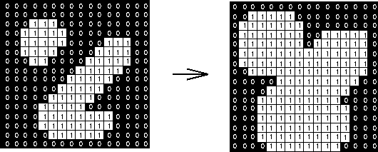
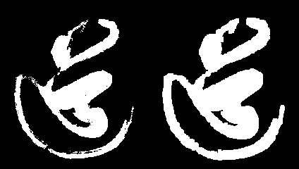
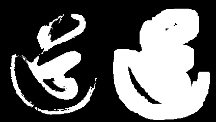
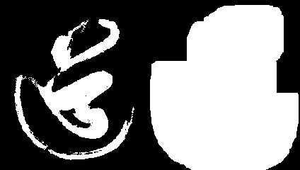

# 膨胀

## 概要
本文讲解了数学形态学中的膨胀, 展示了不同迭代次数下的膨胀效果.

**keywords** 数学形态学 膨胀

## 膨胀dilate

**膨胀是势如破竹的秦国**

膨胀与腐蚀其实刚好是一对相反的操作.

膨胀是将与物体接触的所有背景点合并到该物体中，使边界向外部扩张的过程。可以用来填补物体中的空洞。

**具体运算过程**

假如我们使用的是`3*3` 的核(有时也被称之为**结构元素**). 用核与其覆盖的二值图像做**或 or**操作

如果周边与其自身任意一个点为1，结果图像的该像素为1, 否则为0。


直观效果, 就是图像向外扩增一圈(变得**丰满**了).




膨胀我们要使用`dilate` 函数.

```python
# 膨胀
erorsion_img = cv2.dilate(img, kernel, iterations=1)
```

> 因为操作都类似, 这里我们从简,不做过多讲解,还是以源码阅读为主.


**源代码**

`src/dilate_demo.py`

```python
'''
    数学形态学 膨胀 dilate
'''
import cv2
import numpy as np

# 读入灰度图
img = cv2.imread("dao-bin.png", flags=cv2.IMREAD_GRAYSCALE)

# 创建 核
kernel = np.ones((5,5), np.uint8)
# 膨胀
dilate_img = cv2.dilate(img, kernel, iterations=1)

cv2.imwrite('dao_dilate_k5.png', np.hstack((img, dilate_img)))
```


**迭代次数**`1`



原来稀疏的笔触都被白色(逻辑1, 实际值为255)填满(或者说他们**联合**起来了). 

整体变得丰满. 原来白色区域中的小黑点也不见了.


**迭代次数**`5`




**迭代次数**`10`




随着迭代次数的增多,白色区域逐渐膨大, 内部的黑色孤岛被慢慢吞噬. 最终形成一个完整的, 连通的区域. 

这就像发家时候的**秦国**, 扫灭六国, 完成国家的大一统. 
