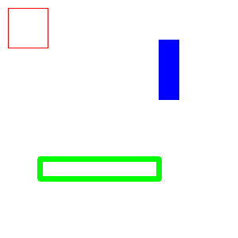

# 绘制矩形

## 概要
讲解了如何使用OpenCV在图片中绘制矩形.

**keywords** OpenCV 矩形绘制 


## 矩形绘制(cv2.rectangle)

```python
# 绘制一个边缘宽度为5的矩形
cv2.rectangle(img=canvas, pt1=(50, 200), pt2=(200, 225), color=COLOR_MAP["green"], thickness=5)
```

**参数说明**

- `img` 图片(画布)
- `pt1` 矩形左上角坐标 (x, y)
- `pt2` 矩形右下角坐标 (x, y)
- `color` 颜色
- `thickness` 边框宽度 ， 如果是-1代表填充

**演示样例**



`CH2.3_DrawRectangle.py`

```python
import cv2
import numpy as np

# 预设几种颜色 B
COLOR_MAP = {
    "white": (255, 255, 255),
    "green": (0, 255, 0),
    "red": (0, 0, 255),
    "blue" :(255, 0, 0)
}

'''
初始化一个彩色的画布
颜色为BGR色彩空间
'''
def InitCanvas(width, height, color=(255, 255, 255)):
    canvas = np.ones((height, width, 3), dtype="uint8")
    canvas[:] = color
    return canvas

canvas = InitCanvas(300, 300, color=COLOR_MAP['white'])

# 绘制一个矩形，左上角坐标为(10,10) 矩形右下角坐标为(60,60)
cv2.rectangle(canvas, (10, 10), (60, 60), COLOR_MAP['red'])

# 绘制一个边缘为5的矩形
cv2.rectangle(canvas, (50, 200), (200, 225), COLOR_MAP["green"], 5)

# 如果宽度(thickness) 设定为-1 则代表填充整个矩形
cv2.rectangle(canvas, (200, 50), (225, 125), COLOR_MAP["blue"], -1)

cv2.imshow("Canvas", canvas)
cv2.imwrite("draw_rectangle.png", canvas)
cv2.waitKey(0)
```