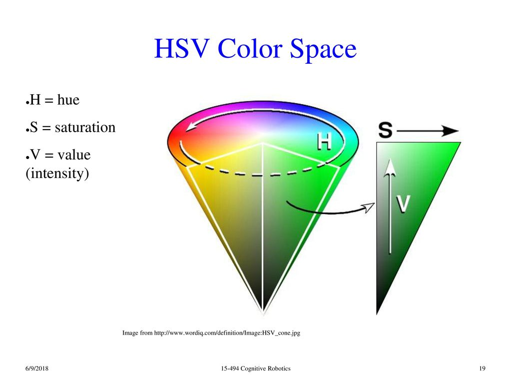

# HSV色彩空间

## 概要
讲解了HSV色彩空间各个通道的含义.

**keywords** HSV 色彩空间

## HSV色彩空间介绍

* H通道: Hue 色调/色彩, 用这一个通道代表颜色.
* S通道: Saturation 饱和度,  饱和度越高,这个色彩越纯.
* V通道: Value 明暗, 数值越高, 代表越明亮

## HSV色彩空间下的颜色统计

这个是我们拍摄的一个图

这里截取瓶盖的部分, 统计瓶盖部分的色彩空间的分布.

获取了瓶盖的子图之后, 我们就要对图片在**HSV颜色空间(color space)**下的统计进行可视化的绘制, 从而**获取颜色阈值的初步参考范围**.

观察上面的统计图,我们可以获取到`蓝色瓶盖`在HSV颜色空间下的分布.

**颜色统计结果**

| 通道(Channel)        | 最小值(Min) | 最大值(Max) |
| -------------------- | ----------- | ----------- |
| H: Hue  色调/色彩    | 96          | 114         |
| S: Saturation 饱和度 | 210         | 255         |
| V: Value  明暗       | 174         | 216         |

## 色块追踪教程
根据颜色的分布, 我们就可以根据这些信息,识别目标色块.

完整的颜色统计与HSV色彩空间下的色块识别, 见教程
[OpenCV色块识别-1Z实验室](https://github.com/1zlab/1ZLAB_Color_Block_Finder)
