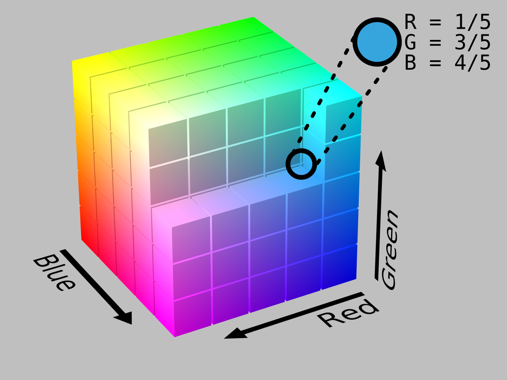
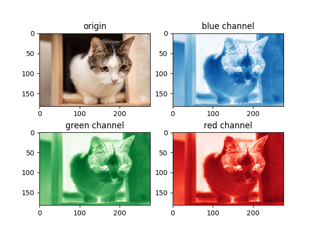

# 色彩空间的介绍

## 概要
讲解了什么叫做色彩空间, 以RGB色彩空间举例,以便让你可以更直观的认识.

**keywords** RGB 色彩空间 向量

## 何为色彩空间

**颜色空间 ColorSpace**跟向量空间其实是一个东西. 举例RGB色彩空间, 我们用Red红色通道, Green绿色通道, Blue蓝色通道三个值来表示一个特定的色彩. 如果我们把颜色当作向量, 那所有向量的集合就是 **色彩空间**, 那RGB的色彩空间长成什么样呢?

就是这样的:

每个颜色在这个空间都有一个自己的坐标.

把一个彩图的R通道, G通道,跟B通道剥离开, 我们看看是啥样的:

三个通道叠加在一起, 就是彩图.

## 除了RGB还有哪些色彩空间?

RGB色彩空间其实是众多色彩空间当中的一种.
除了RGB, 还有BGR, 灰度Grayscale, LAB, HSV等等.
