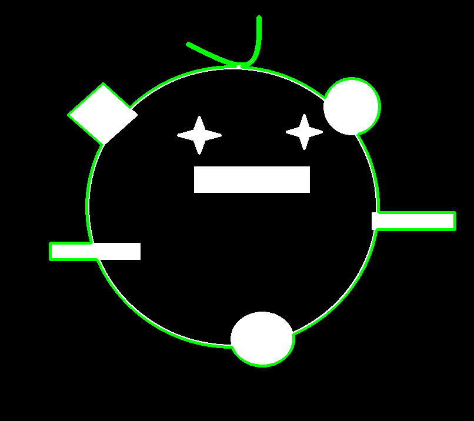
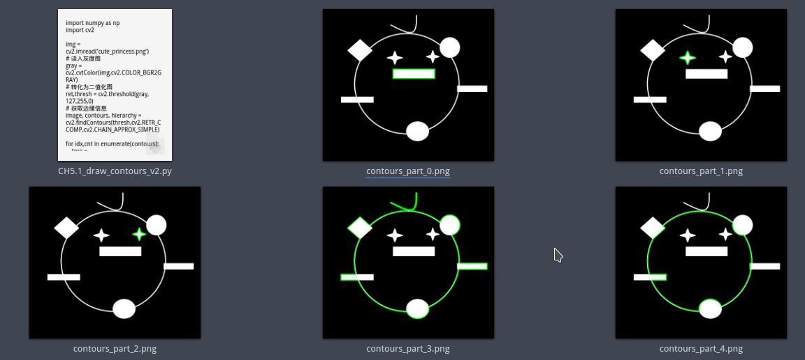

# 连通域检索模式详解

## 概要
美丽的小公主, 实例讲解了不同的连通域检索模式

**keywords** 外轮廓 继承 检索模式

## 模式0: `RETR_EXTERNAL`

只检测外轮廓。忽略轮廓内部的结构。

无继承相关信息.

**效果展示**



返回的 hierarchy矩阵

 **[Next, Previous, First_Child, Parent]**

```
[[[-1 -1 -1 -1]]]
```


## 模式1: `RETR_LIST`

**检测所有的轮廓但不建立继承(包含)关系．**


通过返回的 hierarchy矩阵, 我们可以看出

元素之间的关系均为同级, 没有FirstChild与Parent. (均为-1)

 **[Next, Previous, First_Child, Parent]**

```
[[[ 1 -1 -1 -1]
  [ 2  0 -1 -1]
  [ 3  1 -1 -1]
  [ 4  2 -1 -1]
  [-1  3 -1 -1]]]
```


## 模式2: `RETR_CCOMP`

检测所有轮廓，但是仅仅建立两层包含关系。


**继承矩阵**

 **[Next, Previous, First_Child, Parent]**

```
[[[ 1 -1 -1 -1]
  [ 2  0 -1 -1]
  [ 3  1 -1 -1]
  [-1  2  4 -1]
  [-1 -1 -1  3]]]
```



从矩阵中我们可以得出来外轮廓**cnt3**与眼睛 (cnt1, cnt2),矩形口(cnt0)同级,  判断外层内轮廓(cnt4)是继承自外层外轮廓(cnt3).


## 模式3: `RETR_TREE`


 检测所有轮廓，并且建立所有的继承(包含)关系。

我们文章前面都是以`RETR_TREE` 为例介绍的, 所以这里就不多说, 仅提供继承矩阵.

**注意　选择不同模式，不同序号代表的轮廓不同．**

 **[Next, Previous, First_Child, Parent]**

```python
[[[-1 -1  1 -1]
  [-1 -1  2  0]
  [ 3 -1 -1  1]
  [ 4  2 -1  1]
  [-1  3 -1  1]]]
```