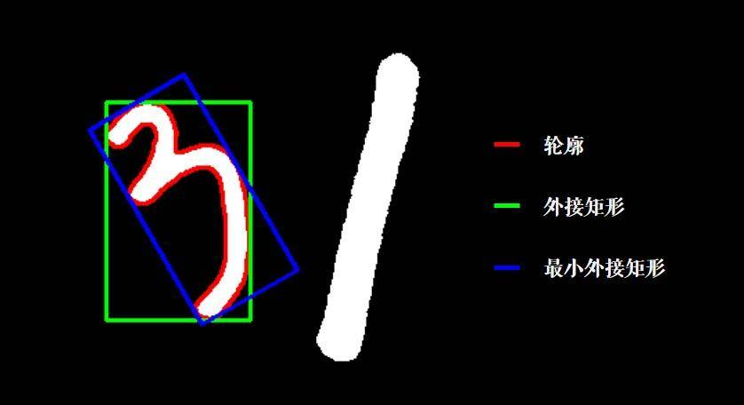
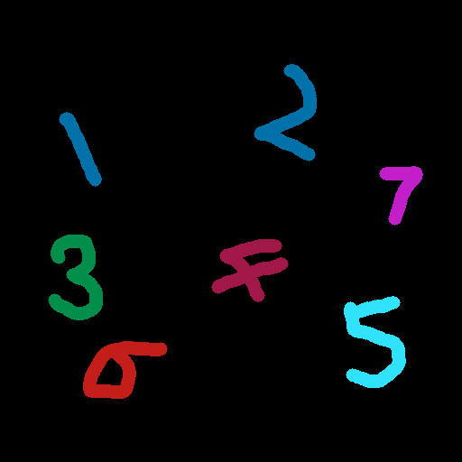
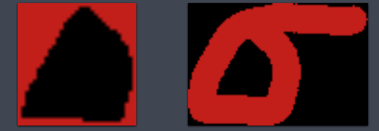
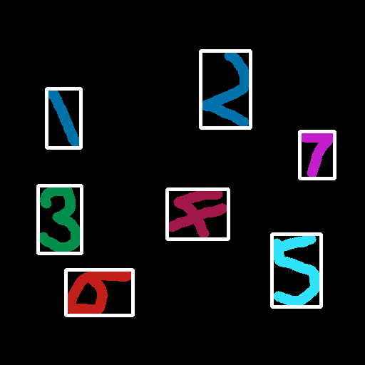
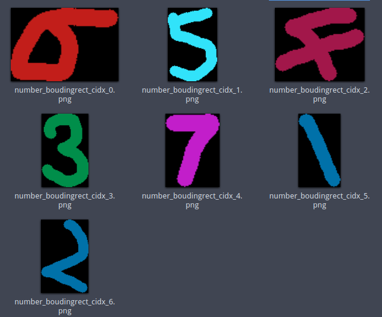
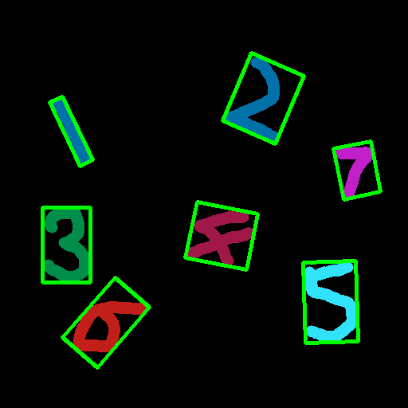
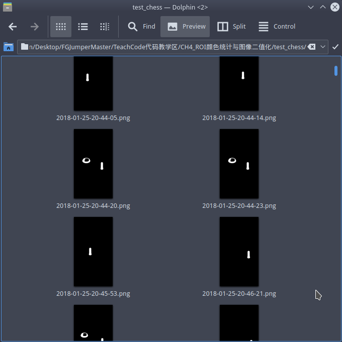

# 连通域的外接矩形

## 概要

阿凯在`CH5.1_获取边缘点集与绘制` 中介绍了寻找二值化图像轮廓的方法.  接下来我们还想找到轮廓对应的矩形区域(**外接矩形**). 

寻找外接矩形有两种策略. 一种是寻找轮廓边缘的部分, 找到最外面的那个外接矩形, 为了区分, 我们称之为**正外接矩形** `boundingRect`,  如下图**绿色矩形**部分.

另外一种策略是矩形可以**旋转**, 找到**面积最小**的矩形, 刚刚好可以把轮廓套在里面,我们称之为**最小外接矩形 ** `minAreaRect`, 如下图**蓝色矩形**部分.



> 图片来源:  [Python+OpenCV教程14：轮廓特征](http://ex2tron.top/2017/12/20/Python-OpenCV%E6%95%99%E7%A8%8B14%EF%BC%9A%E8%BD%AE%E5%BB%93%E7%89%B9%E5%BE%81/)


接下来阿凯会分别介绍opencv中的这两个函数.

**keywords** 外接矩形 最小外借矩形 boundingRect minAreaRect


## 1. 知识回顾-findContours

阿凯手绘了这几个数字. 接下来呢，阿凯想把这些数字所在的矩形区域表示出来, 并截取出单独的图片. 



在`CH5.1_获取边缘点集与绘制` 中阿凯介绍了四种提取轮廓的模式, 那么我们应该用哪个呢?

首先问几个问题：

1. **我们是否关心内轮廓 ?   -> 否**

   如果识别内轮廓的话, 以6举例, 就会识别到左边的这个矩形区域.

   

2. **我们是否关系继承关系 ? -> 否**

   数字图片 没有继承关系。

   ​


所以我们应该使用`cv2.RETR_EXTERNAL`模式 


**源代码**

```python
import numpy as np
import cv2

# 读入黑背景下的彩色手写数字
img = cv2.imread("color_number_handwriting.png")
# 转换为gray灰度图
gray = cv2.cvtColor(img, cv2.COLOR_BGR2GRAY)
# 寻找轮廓
bimg, contours, hier = cv2.findContours(gray, cv2.RETR_EXTERNAL, cv2.CHAIN_APPROX_SIMPLE)
```


## 2. 正外接矩形 boudningRect

函数比较简单, 传入唯一的参数是轮廓点集(单个) **Points**. 

```
rect = cv2.boundingRect(cnt)
(x, y, w, h) = rect
```

返回值 **rect** , 数据结构是tuple, 分别为矩形左上角坐标(x, y), 与矩形的宽度`w` 高度`h`


我们依次打印矩形区域的信息.

```python
for cidx,cnt in enumerate(contours):
    (x, y, w, h) = cv2.boundingRect(cnt)
    print('RECT: x={}, y={}, w={}, h={}'.format(x, y, w, h))
```

**OUTPUT**

```
RECT: x=92, y=378, w=94, h=64
RECT: x=381, y=328, w=69, h=102
RECT: x=234, y=265, w=86, h=70
RECT: x=53, y=260, w=61, h=95
RECT: x=420, y=184, w=49, h=66
RECT: x=65, y=124, w=48, h=83
RECT: x=281, y=71, w=70, h=108
```


绘制在画布上比较直观:




截取ROI图片的操作比较简单` img[y:y+h, x:x+w]`

```python
# 截取ROI图像
cv2.imwrite("number_boudingrect_cidx_{}.png".format(cidx), img[y:y+h, x:x+w])
```

这样我们就截取到了独立的单个数字的图片.




**源代码** `CH5.2_bounding_rect.py`

```python
import numpy as np
import cv2

# 读入黑背景下的彩色手写数字
img = cv2.imread("color_number_handwriting.png")
# 转换为gray灰度图
gray = cv2.cvtColor(img, cv2.COLOR_BGR2GRAY)
# 寻找轮廓
bimg, contours, hier = cv2.findContours(gray, cv2.RETR_EXTERNAL, cv2.CHAIN_APPROX_SIMPLE)

# 声明画布 拷贝自img
canvas = np.copy(img)

for cidx,cnt in enumerate(contours):
    (x, y, w, h) = cv2.boundingRect(cnt)
    print('RECT: x={}, y={}, w={}, h={}'.format(x, y, w, h))
    # 原图绘制圆形
    cv2.rectangle(canvas, pt1=(x, y), pt2=(x+w, y+h),color=(255, 255, 255), thickness=3)
    # 截取ROI图像
    cv2.imwrite("number_boudingrect_cidx_{}.png".format(cidx), img[y:y+h, x:x+w])

cv2.imwrite("number_boundingrect_canvas.png", canvas)
```


## 3. 最小外接矩形 minAreaRect

`minAreaRect` 函数用于获取最小面积的矩形。

```python
minAreaRect = cv2.minAreaRect(cnt)
```

我们打印一下`minAreaRect` 查看其返回的数据结构:

```
((133.10528564453125, 404.7727966308594), (100.10702514648438, 57.51853942871094), -49.184913635253906)
```

数据结构解析

```
((cx, cy), (width, height), theta)
```

* `cx` 矩形中心点x坐标 center x
* `cy` 矩形中心点y坐标 center y
* `width` 矩形宽度
* `height`  矩形高度
* `theta` 旋转角度，角度（**不是弧度**）

**注意: 上述值均为小数, 不可以直接用于图片索引,或者矩形绘制.**

详情见图


> 图片来源 [python opencv minAreaRect 生成最小外接矩形](http://blog.csdn.net/lanyuelvyun/article/details/76614872)


>注意：旋转角度θ是水平轴（x轴）逆时针旋转，与碰到的矩形的第一条边的夹角。并且这个边的边长是width，另一条边边长是height。也就是说，在这里，width与height不是按照长短来定义的。
>
>在opencv中，坐标系原点在左上角，相对于x轴，逆时针旋转角度为负，顺时针旋转角度为正。


为了直观起见, 我们可以直接这样赋值

```python
((cx, cy), (width, height), theta) = cv2.minAreaRect(cnt)
```

完整一些的演示样例:

```python
for cidx,cnt in enumerate(contours):
    ((cx, cy), (width, height), theta) = cv2.minAreaRect(cnt)
    print('center: cx=%.3f, cy=%.3f, width=%.3f, height=%.3f, roate_angle=%.3f'%(cx, cy, width, height, theta))
```

**OUTPUT**

```
center: cx=133.105, cy=404.773, width=100.107, height=57.519, roate_angle=-49.185 
center: cx=415.190, cy=378.853, width=66.508, height=100.537, roate_angle=-1.710  
center: cx=278.323, cy=296.089, width=71.608, height=78.065, roate_angle=-78.440  
center: cx=83.000, cy=307.000, width=60.000, height=94.000, roate_angle=0.000     
center: cx=448.346, cy=213.731, width=47.068, height=64.718, roate_angle=-11.310  
center: cx=89.642, cy=164.695, width=17.204, height=88.566, roate_angle=-25.427   
center: cx=330.578, cy=123.387, width=92.325, height=72.089, roate_angle=-66.666 
```

**如何获取四个顶点? **


利用`cv2.boxPoints` 函数, 我们可以获取矩形区域的四个顶点的坐标。序号如上图所示。

```python
minAreaRect = cv2.minAreaRect(cnt)
print(cv2.boxPoints(minAreaRect))
```


**样例输出**

```
[[ 122.15498352  461.4520874 ]
 [  78.62363434  423.85681152]
 [ 144.05558777  348.09350586]
 [ 187.58694458  385.68878174]]
```


你看这个数据结构是不是跟`contour`的数据结构是类似的。

阿凯突然想到， 其实可以使用`drawContours`函数绘制。

**前提我们还需要将浮点数坐标转换成整数。**

```python
# 声明画布 拷贝自img
canvas = np.copy(img)

for cidx,cnt in enumerate(contours):
    minAreaRect = cv2.minAreaRect(cnt)
    # 将浮点数坐标转换成整数
    rectCnt = np.int64(cv2.boxPoints(minAreaRect))
    cv2.drawContours(canvas, [rectCnt], 0, (0,255,0), 3)

cv2.imwrite("number_minarearect_canvas.png", canvas)
```





我们也可以使用多边形绘制的函数进行绘制， 可能你需要复习一下 **CH2.3_几何图像绘制与文字绘制**

这里阿凯换了一种颜色绘制。

```python
# 绘制多边形
cv2.polylines(img=canvas, pts=[rectCnt], isClosed=True, color=(0,0,255), thickness=3)
```


完整一些的代码

```python
import numpy as np
import cv2

# 读入黑背景下的彩色手写数字
img = cv2.imread("color_number_handwriting.png")
# 转换为gray灰度图
gray = cv2.cvtColor(img, cv2.COLOR_BGR2GRAY)
# 寻找轮廓
bimg, contours, hier = cv2.findContours(gray, cv2.RETR_EXTERNAL, cv2.CHAIN_APPROX_SIMPLE)

# 声明画布 拷贝自img
canvas = np.copy(img)

for cidx,cnt in enumerate(contours):
    minAreaRect = cv2.minAreaRect(cnt)
    # 转换为整数点集坐标
    rectCnt = np.int64(cv2.boxPoints(minAreaRect))
    # 绘制多边形
    cv2.polylines(img=canvas, pts=[rectCnt], isClosed=True, color=(0,0,255), thickness=3)

cv2.imwrite("number_minarearect_canvas.png", canvas)
```


 ## 4. 作业 Homework


### Task01 - 获取棋子底部的坐标并绘制


给大家准备了一下测试样例．

你需要提取图片中的棋子的位置，找到棋子所在的矩形区域，并且标注棋子底部中心点．




请自行学习opencv轮廓**contours**的其他属性[opencv文档-py_contour_features](http://opencv-python-tutroals.readthedocs.io/en/latest/py_tutorials/py_imgproc/py_contours/py_contour_features/py_contour_features.html)

- 质心 moment
- **面积 Area**
- 周长 perimeter
- 边缘近似
- 凸包  与凸包性
- 矩形区域 bounding rectangle
- 最小矩形区域
- 最小闭合圆形区域 minimum encolosing circle
- 椭圆区域  fitting an ellipse
- 线  fitting a line 


并用于轮廓的**滤波**，排除不相干色块区域的干扰.

除此之外你还可以利用横宽比，宽度，高度作为滤波条件．


### Task02 - 提取旋转的矩形

我们目前可以绘制图片中旋转的矩形了， 那么你有办法将他们提取出来么？

请自行搜索图像变换的资料，将数字提取出来。 

提示： 图像旋转 变换

* `cv2.getRotationMatrix2D`  获取旋转矩阵
* `cv2.warpAffine` 变换


**拓展：将矩形区域放缩到统一尺寸，　例如`20*10`**

